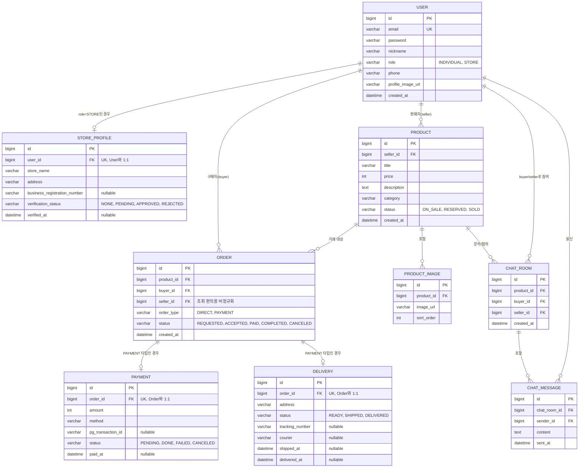

**User(회원)**
개인 사용자와 상점을 계정 테이블 하나로 통합. 둘 다 로그인하고, 상품 올리고, 살 수 있는 기본 권한은 동일
* `role` : 이 계정이 개인인지 상점인지 구분
* `nickname` : 화면에 보여줄 이름
* `profile_image_url`: 프로필 사진 경로

**StorProfile(상점프로필)**
상점만 필요한 정보(주소, 인증여부[인증은 최대한 간단하게 구현])를 User에 안 넣고 따로 뺌. 개인 계정에 필요없는 컬럼이 계속 비어있는 걸 방지.
* `user_id` : 어느 User 계정의 상점 정보인지 연결
* `address` : 자기소개란에 쓸 오프라인 매장 주소
* `verification_status` : 블루체크 인증 신청 상태

**Product(상품)**
거래의 중심 객체. 누가 뭘 파는지 담는 테이블
* `seller_id` : 판매자 (개인이든 상점이든 User 하나로 연결)
* `category` : 상품 분류(단순 문자열)
* `status` : 팔리는 중인지? 예약 됐는지? 팔렸는지?

**ProductImage (상품이미지)**
상품 하나에 사진 여러 장 올릴 수 있기 때문에 `Product`랑 따로 분리
* `sort_order` : 사진 보여주는 순서(대표 이미지 맨 앞에 두는 용도)

**Order(거래)**
직거래랑 예약결제, 이 두 흐름이 상태값(요청 -> 수락 -> 완료)을 그대로 공유해서 테이블 하나로 합침
* `order_type` : 직거래(DIRECT)인지 결제(PAYMENT)인지
* `status` : 거래 진행 단계
* `seller_id` : Product 안 거치고 바로 조회하려고 넣어둔 편의용 컬럼

**Delivery**
* `order_type = PAYMENT`인 Order에만 연결됨 (DIRECT는 배송 개념이 없어서 레코드 자체가 안 생김)
* `status` : READY(배송준비) -> SHIPPED(발송, 이 시점에 tracking_number 입력) -> DELIVERED(수령확인)    
* 실제 택배사 API 연동은 MVP 범위가 아니라 이 프로젝트에서는 운송장 번호를 수동으로 입력하는 수준

**Payment(결제)**
결제 관련 상세 정보는 Order랑 성격이 달라서 따로 뺌. `order_type=PAYMENT`인 주문만 이 테이블에 값이 생김.
* `pg_transaction_id` : 결제사가 발급한 거래번호
* `status` : 결제 자체의 성공/실패 여부

**ChatRoom(채팅방)**
직거래 협의하면 상품 기준으로 구매자-판매자가 대화할 공간이 필요
* `product_id` : 어떤 상품에 대한 채팅인지
* `buyer_id`/`seller_id` : 이 방에 참여하는 두 사람

**ChatMessage(채팅 메시지)**
ChatRoom 하나에 메시지가 여러 개 쌓이므로 별도 테이블 분리
* `sender_id` : 메시지 보낸 사람 (buyer인지 seller인지 User랑 대조해서 판단)
* `content` : 메시지 본문